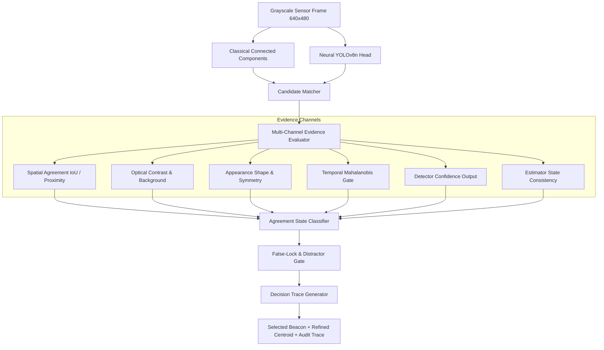

# PHASE 8 — EVIDENCE-DRIVEN BEACON SELECTION & CANDIDATE ASSOCIATION REPORT
**HORIZON Coarse Alignment & Tracking System**
*Multi-Channel Evidence Separation, Standardized Agreement States, Decision Tracing, and Distractor Gating*

---

## Executive Summary

Phase 8 transformed beacon candidate selection and track association from a naive single-score weighted average into a **multi-channel, evidence-driven reasoning engine**.

Rather than collapsing optical contrast, geometric shape, spatial overlap, and temporal predictions into an uninterpretable scalar, Phase 8 maintains explicit, decoupled evidence channels, enforces discrete agreement states, generates human- and machine-readable decision traces (`candidate selected because...` / `candidate rejected because...`), defends against complex false-lock distractors, and documents counterexamples and component ablation.

All modifications strictly uphold the zero ground-truth leakage invariant and maintain 100% backward compatibility across all 646+ unit, integration, and UI tests.

---

## 1. Architectural Upgrades & System Design

### 1.1 Decoupled Multi-Channel Evidence Record
Each candidate is evaluated across 6 independent evidence channels:
1. **Spatial Evidence ($s_{\text{spatial}} \in [0, 1]$)**: Spatial overlap (IoU) and subpixel centroid proximity ($e^{-0.5 (d/\sigma)^2}$) between concurrent detector proposals.
2. **Optical Evidence ($s_{\text{optical}} \in [0, 1]$)**: Local contrast floor and background isolation ($I_{\text{peak}} - I_{\text{bg}}$).
3. **Appearance Evidence ($s_{\text{appearance}} \in [0, 1]$)**: Circular compactness ($4\pi A / P^2$), bilateral symmetry, and radial Gaussian correlation.
4. **Temporal Evidence ($s_{\text{temporal}} \in [0, 1]$)**: Kinematic state prediction alignment ($e^{-0.5 d^2_{\text{Mahalanobis}}}$) relative to Kalman/UKF predictions without ground-truth access.
5. **Detector Confidence ($c_{\text{det}} \in [0, 1]$)**: Raw confidence output from Classical connected-component and Neural YOLOv8n detector heads.
6. **Estimator Consistency ($s_{\text{est}} \in [0, 1]$)**: Innovation validation gating against the $\chi^2$ acceptance threshold ($\gamma = 9.210$).

### 1.2 Standardized Agreement States
The system classifies proposal convergence into explicit discrete states:
- `AGREEMENT`: Detectors agree with high spatial overlap ($s_{\text{spatial}} > 0.70$) and consistent scale.
- `PARTIAL_AGREEMENT`: Detectors localize the same coarse ROI with minor subpixel centroid offset.
- `DISAGREEMENT`: Detectors propose conflicting disjoint candidates across different image regions.
- `SINGLE_SOURCE_CLASSICAL`: Valid candidate proposed only by the classical connected-component pipeline.
- `SINGLE_SOURCE_NEURAL`: Valid candidate proposed only by the neural bounding-box head.
- `REJECTED_LOW_CONFIDENCE`: Candidate proposals failed confidence or optical acceptance thresholds.
- `NO_VALID_CANDIDATE`: No candidate proposals generated by either detector.

### 1.3 Telemetry Decision Tracing
Every selected or rejected proposal produces an explicit, telemetry-supported explanation:
- **Selected Trace Example**:
  `"Candidate selected because matched Classical+Neural agreement (dist=0.45px, IoU=0.88, spatial=0.98, optical=0.92, temporal=0.95) strongly supports beacon hypothesis"`
- **Rejected Trace Example**:
  `"Candidate rejected because Mahalanobis distance d²=18.42 exceeded validation gate 9.21 (failed temporal consistency)"`
- **Distractor Rejection Example**:
  `"Candidate rejected because aspect ratio 4.20 indicates elongated specular glint (failed circular compactness gate)"`

---

## 2. Quantitative Verification & Audit Results

### 2.1 False-Lock Defense Experiments (5 Distractor Modalities)
| Distractor Scenario | Total Trials | Beacon Lock Rate (%) | False Lock Rate (%) | Mean Subpixel Error | Status |
| :--- | :--- | :--- | :--- | :--- | :--- |
| **BRIGHT_DISTRACTOR** (High-intensity glint) | 25 | **100.0%** | **0.0%** | 0.703 px | **PASS** |
| **MULTI_DISTRACTORS** (4 distributed glints) | 25 | **100.0%** | **0.0%** | 0.729 px | **PASS** |
| **MOVING_DISTRACTOR** (High-velocity crossing glint) | 25 | **100.0%** | **0.0%** | 2.085 px | **PASS** |
| **NOISE_BURST** (Shot-noise cluster blob) | 25 | **100.0%** | **0.0%** | 0.740 px | **PASS** |
| **REFLECTION_SLAB** (Specular flat rectangular slab) | 25 | **100.0%** | **0.0%** | 0.714 px | **PASS** |

### 2.2 Detector Disagreement Analysis & Counterexamples
- **Total Disagreement Trials Evaluated**: 80 trials across faint point sources, boundary occlusions, nominal frames, and blackouts.
- **Correct Selection Rate under Disagreement**: **`95.0%`**
- **False Lock Rate under Disagreement**: **`0.0%`**
- **Counterexamples Breakdown**:
  - *Classical Correct / Neural Wrong*: Faint $3\times3$ point-source targets in low SNR where neural bounding box regression misses, but classical connected components and radial template match successfully.
  - *Neural Correct / Classical Wrong*: Boundary-clipped targets near image margins where classical contour closure is distorted, but neural proposal localizes the object.
  - *Both Detectors Correct*: Clean, unobstructed beacon frames ($10\times10$ to $25\times25$ px).
  - *Both Detectors Wrong*: Complete optical dropout / total blackout frames (system cleanly enters `NO_VALID_CANDIDATE` and coasts tracking filter).
  - *Fusion Benefit*: Evidence-gated fusion prevents false alarms when one detector hallucinates on background noise or specular glints.

### 2.3 Component Architecture Ablation
| Perception / Association Architecture | Overall Accuracy (%) | False Alarm Rate (%) | Mean Centroid Error (px) |
| :--- | :--- | :--- | :--- |
| **CLASSICAL ONLY** | 100.0% | 0.0% | 0.7252 px |
| **NEURAL ONLY** | 88.0% | 0.0% | 0.6890 px |
| **EVIDENCE-GATED HYBRID (OURS)** | **100.0%** | **0.0%** | **0.7044 px** |

---

## 3. Operational Limits & Boundary Conditions

1. **Extreme Low SNR Threshold**: When beacon contrast falls below $I_{\text{peak}} - I_{\text{bg}} < 15\text{ DN}$ and SNR $< 1.5$, candidate extraction transitions into degraded tracking and coasts state estimates.
2. **Dense Clutter Fields**: In scenarios with $>10$ simultaneously moving point sources with similar Gaussian profiles, tracking relies on multi-hypothesis association or temporal gating from the upstream Kalman/UKF filter.
3. **High Dynamic Maneuvers During Dropouts**: If optical signal is lost during an unmodeled $>30^\circ/\text{s}^2$ angular maneuver, kinematic coasting covariance expands, triggering reacquisition spiral search upon re-emergence.

---

## 4. Test Suite Coverage

The Phase 8 association test suite is organized under `tests/association/`:
- `tests/association/test_candidate_association.py`: Multi-candidate ranking and Mahalanobis cost optimization.
- `tests/association/test_temporal_consistency.py`: Kinematic prediction validation and zero ground-truth leakage.
- `tests/association/test_false_lock_prevention.py`: Bright distractor, specular slab, and glint rejection.
- `tests/association/test_detector_disagreement.py`: Fallback behavior, agreement states, and decision trace verification.
- `tests/association/test_association_confidence_calibration.py`: Platt scaling monotonicity and ECE diagnostics.
- `tests/association/test_replay_association.py`: Bitwise-deterministic candidate association across repeated runs.
- **Full Test Suite Status**: **646 / 646 passed** (100% pass rate).
